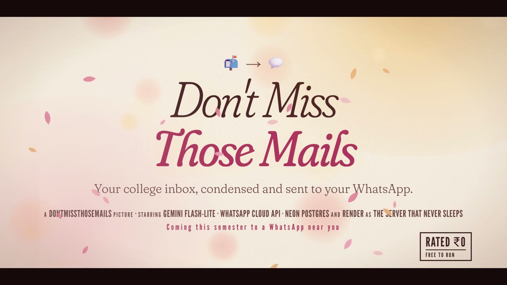

# DontMissThoseMails 📬 → 💬

**Your college inbox, condensed and sent to your WhatsApp, with reminders that keep going until you're done.**

Built by an IIIT student, for IIIT students (`iiit.ac.in` Outlook accounts). Free to run, and nothing runs on your laptop.

<p align="center">
  <a href="brag-output/brag.mp4">
    
  </a>
  <br>
  <sub>▶️ <a href="brag-output/brag.mp4">Watch the 25-second trailer</a> (sound on)</sub>
</p>

> ### 👉 Set it up: **[HOW_TO_RUN.md](HOW_TO_RUN.md)**
> Step-by-step, about 60–90 minutes, ₹0. It's the exact setup that works with IIIT accounts, including the workarounds
> for IIIT's "Need admin approval" block and WhatsApp's webhook quirks.

---

## What it does

- 📚 **Moodle assignments, quizzes, official deadlines** → a WhatsApp summary with the exact due time, then reminders at
  72h / 24h / 6h / 1h until you tap **✅ Done**.
- 🎉 **Club events, talks, hackathons** → a short summary plus *"Interested?"*. Say yes and it reminds you to register (before
  registration closes and every evening) until you say **registered**, then reminds you before it starts.
- 🏛️ **Notices** (exams, timetable, hostel, opportunities) → 2–4 sentences with the key link.
- 📰 **Newsletters and promos** → dropped. Low-priority mail → one line in the 08:00 **daily digest**.
- 🔁 **Your own reminders, set in chat:** *"remind me to put attendance on ISB every hour after 9am until I say done,
  every day"*. It pings you every hour until you tap **✅ Done for today**, then starts again tomorrow.
- ↩️ **Swipe-reply** `done` / `snooze 2h` / `no` to any bot message. No #id needed, and `undo` if you slip.
- 💬 **Talk to it normally:** *"I submitted the OS assignment"*, `snooze 12 2d`, `add DBMS project due Friday 5pm`, `list`.
- 📥 **One-time catch-up:** forward last week's mail once and get a single summary of what still matters.

Full list: **[FEATURES.md](FEATURES.md)**.

## How it works

```
 IIIT Outlook ──forwarding──▶ Gmail "mailbot" ──IMAP, every 5 min──▶ bot (Render, free)
                                                                        │
                    Gemini free tier: ONE call per email ◀──────────────┤  classify · summarise · extract dates/links
                    (rotates Flash-Lite → Flash → Gemma, and across keys)│
                                                                        ▼
                      reminders · daily digest · quiet hours ──▶ WhatsApp Cloud API ──▶ your phone
                                                                        ▲
                                     your replies / button taps ────────┘   (webhook)

 State (deadlines, reminders, queue) lives in Neon Postgres (free). cron-job.org pings it every 5 min to keep it awake.
```

Why the Gmail detour? IIIT's Microsoft tenant doesn't let students approve apps that read their mailbox
("Need admin approval"). Forwarding to a dedicated Gmail avoids that, and the bot unwraps forwards so it still sees the
original sender (e.g. Moodle). If your IT approves the app, the bot can read Outlook directly
([HOW_TO_RUN → Appendix A](HOW_TO_RUN.md#appendix-a-reading-outlook-directly-only-if-iiit-it-approves)).

## What you need (all free)

| Service | For |
|---|---|
| GitHub | your fork of this repo |
| Gmail (a new one) | receives your forwarded college mail |
| Google AI Studio | 2 Gemini API keys (in 2 different projects) |
| Meta for Developers | WhatsApp Cloud API test number |
| Neon | Postgres database |
| Render | hosting |
| cron-job.org | keep-alive pinger |

## Docs

| File | What's inside |
|---|---|
| **[HOW_TO_RUN.md](HOW_TO_RUN.md)** | Full setup, troubleshooting, local development |
| [FEATURES.md](FEATURES.md) | Everything the bot does, and how |
| [.env.example](.env.example) | Every setting, documented |

## Project layout

```
app/
  main.py              FastAPI: WhatsApp webhook, admin + diagnostics pages, /cron/tick, /privacy
  scheduler.py         1-minute tick: mail → AI queue → reminders → catch-up → digest → outbox
  config.py            all settings (env vars)
  db.py, models.py     SQLAlchemy models (SQLite locally, Postgres in production) + auto column upgrades
  clients/             gemini.py (free-tier model/key rotation) · whatsapp.py
  mail/                imap.py (Gmail, forwards, bulk forwards) · graph.py (Outlook direct) · base.py
  services/
    decisions.py       all AI: one Gemini call per email / per free-text message
    pipeline.py        email → queue → analysis → items → first notification (or quiet catch-up)
    reminders.py       deterministic reminder planner (deadlines, events, routines)
    routines.py        schedules for reminders you set up in chat
    digest.py          daily digest + catch-up summary
    commands.py        WhatsApp commands and free text
    notifier.py        quiet hours, pause, 24h window, outbox
    messages.py        WhatsApp message templates
scripts/try_email.py   see what the AI makes of an email
tests/                 pytest suite (SQLite or Postgres)
render.yaml            one-click Render blueprint (IMAP / Gmail defaults)
```

## Privacy

Your mail passes through your own Gmail, your own Render app and Google Gemini's free tier, which may use prompts to improve
Google's products. Nothing is shared with the author or anyone else. Mail bodies are deleted from the database after
analysis. Add senders you never want processed to `IGNORE_SENDERS`.
